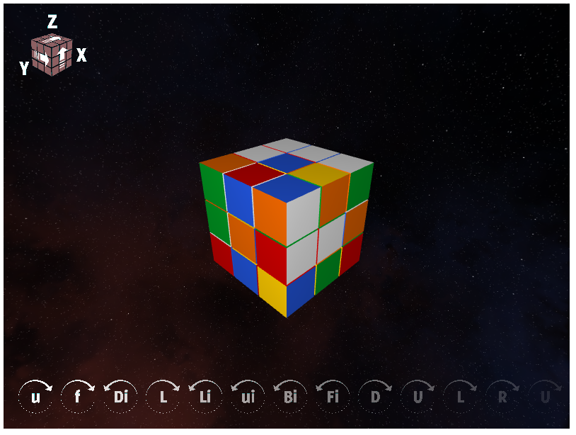

# Rubiksawesome
ISEN C Project
Rémi B.
Rodolphe H.
Alexandre T.


> Our whole life is solving puzzles.
>
> _<div style="text-align: right"> Erno Rubik </div>_


## Intro
Rubiksawesome is a Rubik's Cube 3x3x3 simulator with a 3D display and a solver
engine.
It is developped as a school project @ISEN-Lille.

Here is a capture of the current state:



The objectives evaluated are available (in French) in the file linked below :
[`topic.pdf`](docs/topic.pdf).

## Key features
* 3D model
  * Rotations animations
  * Lighting
  * Texturing
  * Skybox
  * Mouse and keyboard inputs
  * Beautiful win screen
  * Marvelous Creative Commons sound effects
  * Display of the command history
  * Enabling/Disabling of command overlay
* Command-line arguments for game modes
    * Random scrambling (default)
    * Precise scramble
    * Non-scrambled cube
* Solving algorithms
  * Jessica Fridrich

## How to play

Move the view by clicking and dragging with your mouse.
The scroll wheel can be used to zoom/unzoom.

The keyboard shortcuts are:

Key | Function
--- | ---
`I` | Enable/Disable instructions
`Left Shift` | Rotate counterclockwise
`Left Ctrl` | Rotate 2 slices at once (lowercase moves)
`F` | Rotate front
`B` | Rotate back
`U` | Rotate up
`D` | Rotate down
`L` | Rotate left
`R` | Rotate right
`X` | Rotate the cube around X axis
`Y` | Rotate the cube around Y axis
`Z` | Rotate the cube around Z axis

## Requirements

Rubiksawesome needs:

```
SDL version: 1.2.15
OpenGL version: 3.0
```

and can be compiled using `gcc` on a GNU/Linux system. 
**Windows is not supported, nor it ever will be**.

For documentation generation, `doxygen` is required.

### Recommended setup

* CPU : core i7
* RAM : 16 GB or more (program leaks AF)
* GPU : Nvidia TITAN V (ultimate quality may need a quantic GPU)

## How to use

```shell
# Clone repository
$ git clone ...

# Step into project folder
$ cd rubiksawesome

# Use make to build the project
$ make

# Enjoy !
$ ./rubiksawesome
```

### Options
```
$ ./rubiksawesome -h
```
outputs :

```
Usage is :
	./rubiksawesome [-option [scramble str]]
Options are
	-S [scramble str] : scramble the cube to a randomly generated scramble (default behavior)
		or to a scramble sequence passed as a double quote delimited string
	-C : start the came with a completed Rubik's Cube yours to scramble
```


## Documentation
[`MODEL.md`](MODEL.md) : Description of data model.
[`RESOURCES.md`](RESOURCES.md) : Sources of inspiration.
[`TODOs.md`](TODOs.md) : What is done and not yet accomplished.

### File structure
> /  
> |  
> |-- src/  
> |     |  
> |     |-- model/  
> |     |-- view/  
> |     |-- controller/  
> |     |-- tests/  
> |     |-- main.c  
> |     |-- main.h  
> |  
> |-- build/  
> |-- docs/  
>
