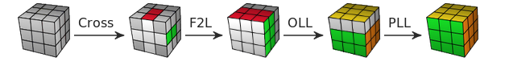
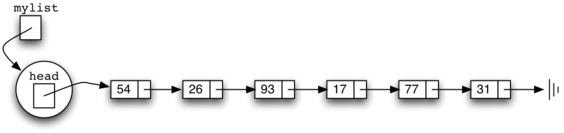
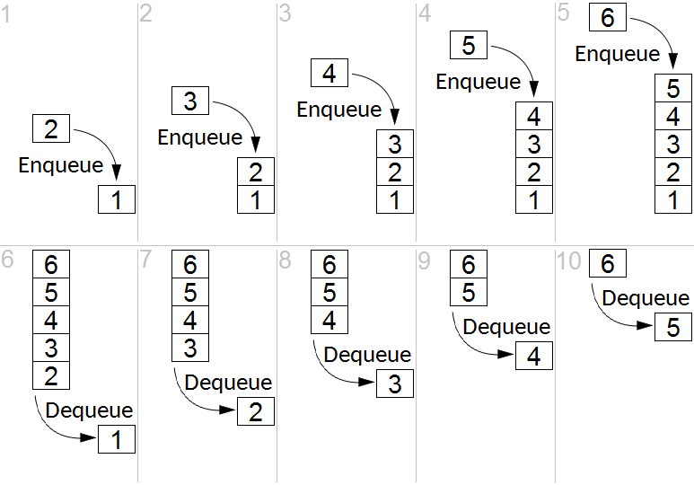

# Controller
The controller is in charge of all data flow, control and core logic of the application. It is composed mainly of solving algorithms, utilities used throughout all the project, and modules used to control the game state workflow.

## Helper modules

### `utils.c`
This file is the home of general-purposes functions that simplifies customary operations.
It holds mainly two wrappers for allocation functions of the standard library :
* `malloc`
* `realloc`

These two functions are doing their job just fine as they are. However, the way they are designed forces the developer to check every time the **return value** of the function. If the allocation goes wrong, the variable might end up with an invalid _NULL_ pointer value, and cause **undefined behaviour**. This can be tiresome to check the returned value by `malloc` or `realloc`. 

We made the choice to wrap these calls to the memory allocator by functions doing the extra verification for us. In case of bad return value, the program is killed _via_ an `exit` call.

The design choice may be radical, but it is motivated by a _"fail fast"_ philosophy. Taking into account that an failed `malloc` call is very rare, we chose to restrict the possibilities to the defined behavior of succeeded calls. If the `malloc` calls fails, there is something very wrong with your system and/or program indeed!

### `errorController.c`
This file was intended to host all error and exception management functions.
There is a single function in it at the moment called `exitFatal()`. This function handles the printing of an error message in `stderr`, allocates a value to `ERRNO` and exits the program with an error value.


## Solving algorithms

A simplified version of the Jessica Fridrich algorithm was implemented. This algorithm is divided into three successive steps. The cube is oriented to have yellow side on the top and white side on the bottom, a side being represented by it central piece.




### `f2l.c`
F2L acronym stands for "First Two Layers". It consists to achieve the two first layers of the cube that is to say 1 face and 2 outlines. There are three stages for F2L :
#### White cross
The white cross is done when all whites edges are aligned with the corresponding center color. A white cross must appear on the white side.
#### Orientation of white edges
This step consists to place correctly a white corner beetween his two reference colors with the white color oriented down. When all the corners are placed, the white side must be enterely white, and the first outline must have each of its sides colors corresponding to the central color.
### Place second layer
To finish F2L, each of non-yellow edges need to be inserted beetween its correct two centrals colors.

### `oll.c`
OLL acronym stands for "Orient Last Layer". It consists to obtain a yellow side on the top of the cube. There is two stages for OLL :
#### Yellow cross
Like the white cross, the yellow cross is made up of all the yellow edges. Nevertheless, the goal here is to obtain a cross regardless of edges position. The yellow cross have to appear on the yellow face.
#### Orientation of yellow edges
To finish the yellow side, each corners must be oriented so that the yellow color is on the top.
### `pll.c`
PLL acronym stands for "Place Last Layer". It consits to solve the cube by finish the yellow face and its outline. There are two stages for PLL :
#### Place last layer edges
Rotate the position of yellow edges in order to create a cross fitting each edge with the correct center color.
#### Orientation of last layer corners
Rotate the position of the yellow corners until to obtain a finished layer. Every corner must be beetween its two reference colors to be rightly placed.

After this last step, the Rubik’s cube is finally solved.

## Game flow logic
### `arguments.c`
This file holds the logic of command-line arguments parsing, and for the game initialization. This is where the **game mode** is identified and fixed until the game window.

### `commandParser.c`
This file contains the logic to manage list of commands into the form of  **strings** or **array of `move`** (cf [MODEL.md])(MODEL.md) and to execute it as a bulk on the 2D data model. It is used by the scrambling functions and by the arguments parsing functions. 

The scrambling functions are composed of one function generating a random sequence of moves, and a scrambler that uses that functionality and apply it on both 2D and 3D models.

### `commandQueue.c`
This file is a library to manage linked list of `move` as FIFO queues or LIFO stacks.




The linked list is made of pointers to `moveLink`, a structure holding the value and the pointer to the next link.
The type manipulated to manage the queue is, however, a `mvqueue`, initialized with `initQueue()` and provided with a public interface to manipulate the data structure. Our objective was to have a queue system that would be easily manipulated.
The data strcture holds pointers to the head and tail of the list so it can be manipulated both in **LIFO stack** and **FIFO queue**.
```c

typedef struct movequeue {
    moveLink * head;
    moveLink * tail;
} movequeue, movestack;
```

Aliases to `movequeue *` and `movestack *` are declared `mvqueue` and `mvstack` respectively to hide further the pointer mechanics.

Once initialized, the data structure can be either use in a **LIFO manner** :


or in a **FIFO manner** :



To use the LIFO interface, one should declare and initialize a `mvstack` and use `push()` and `pop()` functions.

To use the FIFO interface one should declare and initialize a `mvqueue` and use `enqueue()` and `dequeue()` functions.

Both can use the `isEmpty()` function. The `freeQueue()` and `freeStack()` functions are available to dispose of the data structure when no more wanted. 	 

Some functions where created with the purpose of simplifying `move` arrays manipulation like `mvCat` which provides a similar functionality as `strcat` for strings. However, we did not made the choice of  concatenating arrays directly on the original array, like in the standard string library. We chose to create a new array of moves being the concatenation of the two passed as arguments. 

With this choice, bad memory management can cause memory leaks if the developer forgets to free the two original arrays when he does not need them anymore. This design choice has been made to facilitate the memory allocation needed to concatenate two arrays. We thought it was safer to have the memory allocation simplified, hidden and secured even if leaks could happen. Computers have way more RAM today than in the time when the C standard library was first written, so we can allow more memory usage for a little game as this one. If the developers are as careful in their use of this function as they are with standard allocation, there should be no problem.

In the general public interface for a queue of `move` however, there is no need
for the developer to be aware of mechanisms such as allocation and unallocation of memory. These operations are always the same and there is no ambiguity when someone wants to add or remove an object from the queue. The memory allocation and freeing are therefore masked to the user.

### `history.c`
This file holds the logic of the history functionality : how a value is stored, how it is removed.
It uses mainly the functions of `commandQueue.c`

### `patternComparator.c`
This is the file holding the logic to compare cubes between them. Some cubelets can be set to `' '` to ignore the value of the cubelet,  thus creating a pattern comparator.
This functionality is at the core of the algorithm solving logic, and to the control of the state of the game data. For instance it is used to know if the player has beaten the game.
