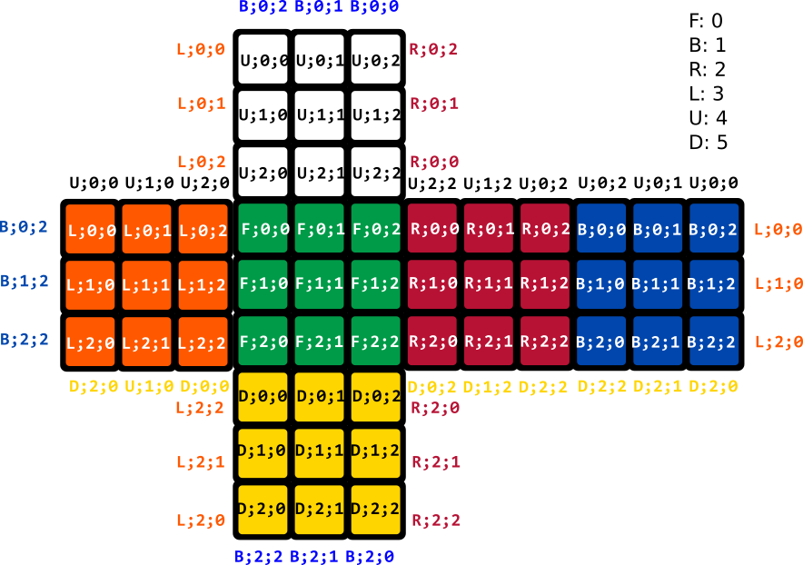

# Model
The data model implemented in the program makes the distinction between the
color of the faces and the position of the cublets in 3D space.

## cube.c
The file `cube.c` implements a pattern mapping of the colors of the **54 faces** . The data structure is a list of the **six faces** each composed of **9 cublets faces**.
This data model is inherently in 2 dimensions, just as an opened die pattern.



When displayed by the program, the cube looks like this :
```
        |g|o|g|
        |y|g|y|
        |r|b|g|
 |y|o|g||y|w|w||o|g|r||w|w|o|
 |w|o|o||b|y|y||r|r|g||o|w|r|
 |b|b|y||r|b|b||w|g|b||o|g|w|
        |b|y|o|
        |r|b|r|
        |r|w|y|
```
The displayed characters describe the color of the cubelet.
* `g` for **green**;
* `b` for **blue**;
* `r` for **red**;
* `o` for **orange**;
* `w` for **white**;
* `y` for **yellow**;

### enum `move`
This enumeration maps all implemented cube rotations :
* 6 main moves
* 3 axis reorientations of cube
Multiplied by :
* Counter-clockwise counterparts
* Double moves
For a grand total of 60 natives moves !! What a treat !!
Some special moves are also integrated for user interaction
* `RETURN` cancels the previous move
* `RESTART` resets the game
* `SOLVE_PLS` resolves the cube automatically

### Data structure
The data structure of the cube implements an object-oriented-programming-like data encapsulation. It carries its interface within itself.  The data is in the `cube` data structure and should only modified _via_ the function pointers attached.

#### Public interface
The interface functions available are
* `rotate` : to perform a rotation
* `copy` : to create a deep copy of the cube (**to be freed after use**)
* `equals` : to perform a comparison of two cube models
* `print` : to display the cube in the console

This interface should be enough for data manipulation. All data modification should be operated _via_ `rotate` to ensure the modification is performed correctly.
The unnecessary logic of data manipulation is hidden in the `.c` file.

For comparison, the cubes are compared after being redressed in the same
direction. To do so, the centers are considered fixed point and oriented in
standard position. Then each color is compared one by one.

### Helper functions
For algorithmic resolution and data management, some `cube` and `move`
manipulation functions are provided.

### mapCodeToMove, mapMoveToCode, inverseMove
These functions allows to parse a string move code to its corresponding move and
vice-versa. The inverse move function return the complementary move. The
complementary move is such that performing the original move and the
complementary move sequentially on the cube outputs the same result as doing
nothing.

## positionCommand, positionCube
Theses functions helps the logic in cube orientation 

## Other data structure
3D mapping of pointers to 3D cubes.

## cubelet.c
The cubelet.c implement a mapping of each cubelet from the Rubik’s Cube. The cube is composed of 27 elements, which are :
- centers, formed by one tile
- edges, formed by two tiles
- corners, formed by three tiles

A tile is define by three informations, its row, its column and its face.
The centers are defined easily cause they are the only element which are not moving. In the cube matrix, they always appear at cube\[FACE\]\[1\]\[1\] position.
In order to define an edge, there is a need to know which is the tile located on the other side corresponding the present tile position.
And to define a corners, the two adjacent tiles have to be found corresponding to the present tile position.

For all these elements, a display function was implemented to make them appear on a void cube pattern. 

Thus, these functions allow the solving algorithm to find and to track a element in order to know the correct sequence to apply.


